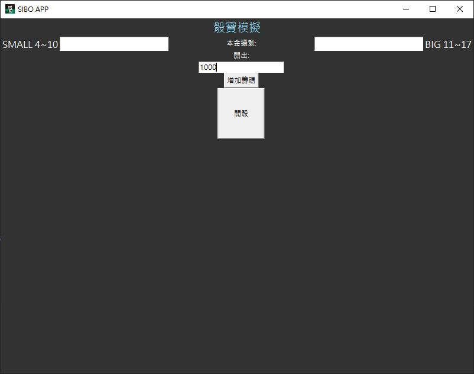
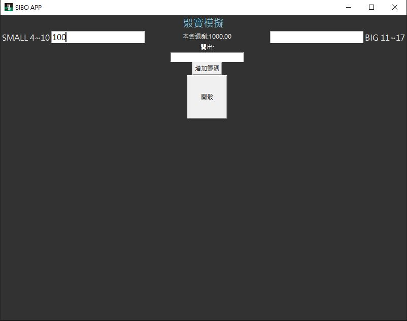
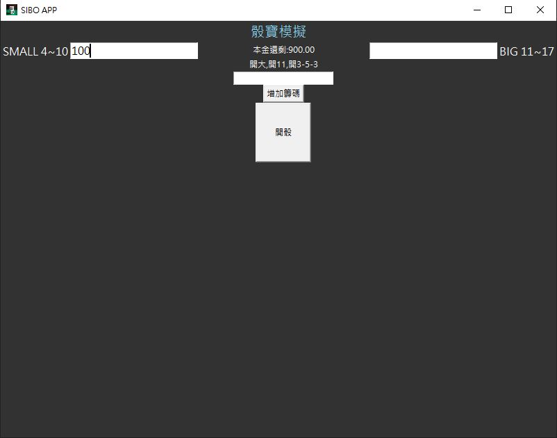

# 骰寶策略模擬器

## 專案說明

### 專案動機

本專案為實現著名賭場遊戲骰寶的開大小簡易模擬器，可以讓想要體驗骰寶或是想要測試策略的人可以再去真實下注前先培養感覺。

### 專案架設

使用python來實現演算法的實作，搭配tkinter來架設簡易的使用介面

### 環境安裝

- 運行sibo.py
    
    ```bash
    python sibo.py
    ```
    

### 操作方式

- 增加籌碼
    
    
    
- 選擇下注小或大以及輸入下注籌碼
    
    
    
- 按下開骰即可觀察開出的結果
    
    